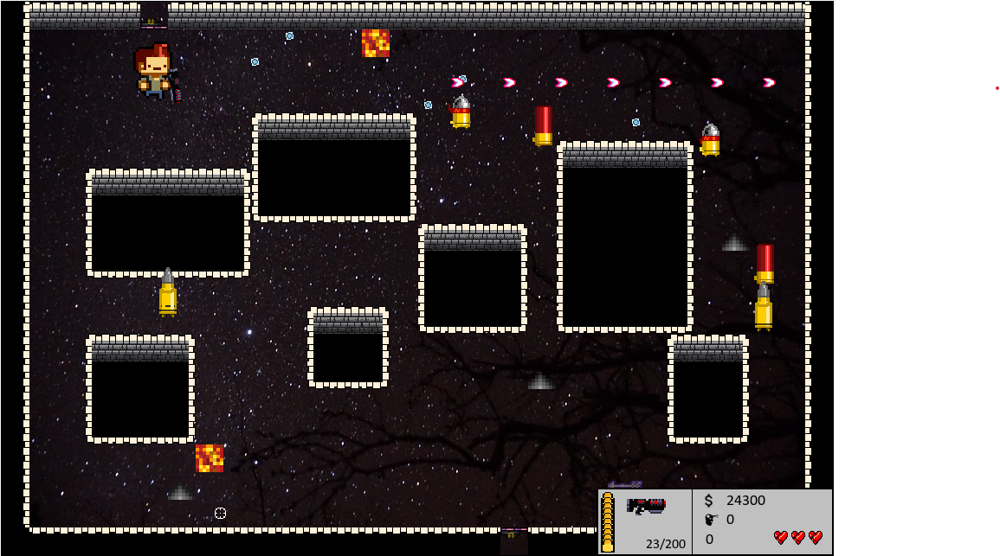

# Gungeon
A remake of the Classic Enter the Gungeon in Greenfoot (Java Framework)! 

## Description
Gungeon is a remake of the classic Gungeon. The player travels through chambers/rooms, shooting enemies and avoiding traps to beat the game. It contains a store to allow the user to buy items like more guns, health refills, and ammo. It can be saved to a text file so the user can continue playing from a checkpoint. The tutorial shows how the game works and its controls. Enter the Gungeon!

## How to Run
1. Download [Greenfoot](https://www.greenfoot.org/download)
2. `git clone link_of_this_repository`	
3. `cd SpaceWars`
4. Open *project.greenfoot*
5. Click *Run* to begin the simulation! 

## How the Game Works
Check out the [Flowchart](Flowchart.pdf), [API](API.pdf), and [Class diagram](ClassDiagram.pdf) to learn more!

### Credits
**Graphics:** Star Xie, free4kwallpapers.com, and Enter the Gungeon.

**Music:** ZapSplat, soundcloud.com, Super Mario, and Enter the Gungeon.